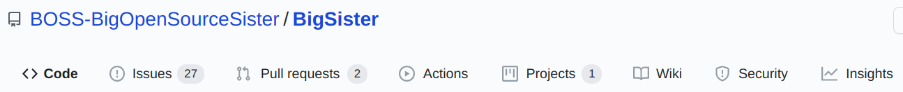
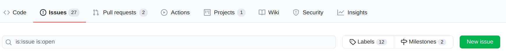
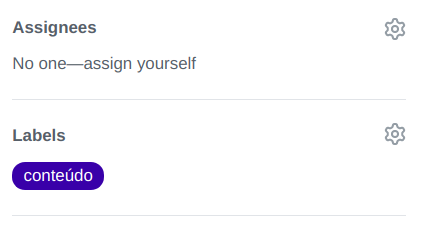
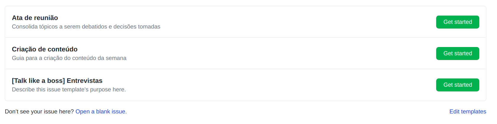
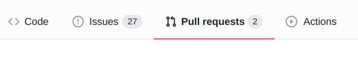
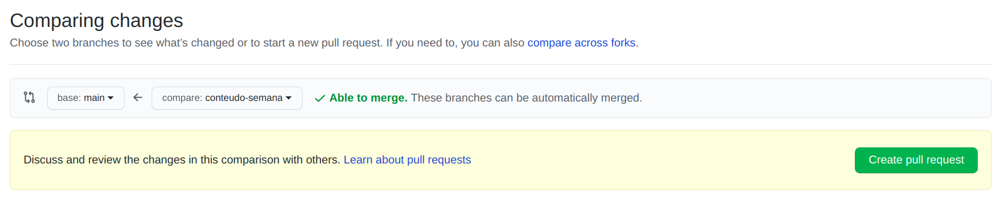
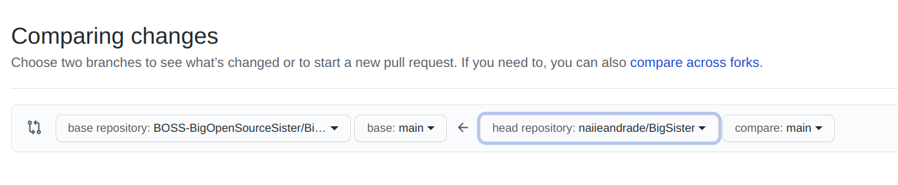

Quer contribuir com o projeto? Sugerir conteúdos, melhorias? :+1::tada: 

Este é um documento para orientar contribuições no repositório da iniciativa BOSS. 

## O que devo saber antes de começar?
Este repositório contém documentação sobre a iniciativa: o que é o programa, quem pode participar, atas de reunião; materiais dos conteúdos que foram passados; tutoriais e a organização do projeto. 

## Sugestão ou reportar erros
Tem alguma sugestão de conteúdo, tutorial ou correção de conteúdo, texto gramatical?

Caso queira fazer alguma sugestão ou reportar erros, nos informe [criando uma issue](https://github.com/BOSS-BigOpenSourceSister/BigSister/blob/conteudo-semana/CONTRIBUTING.md#criando-issue) e descreva a sugestão/correção de forma clara.

Para isso, pode seguir estes passos:
- Nomeie a isso com um nome claro de acordo o problema;
- Descreva a sugestão/erro e onde encontrá-lo;

## Contribuir com conteúdo

Caso queira contribuir corrigindo algum erro ou com criação de conteúdo existem duas possibilidades: ou você tem acesso a edição neste repositório ou não tem.

### Com acesso de edição ao repositório

Se tiver acesso de edição neste repositório:
- Crie uma branch a partir da `main` com o nome que envolve a atividade a ser feita, por exemplo: `adicionar-conteudo-semana` 
- Faça as alterações e atualize a branch na qual está trabalhando
- Depois peça um PR para a main e marque alguém que faça parte do repositório para fazer a revisão do PR
- Se tiver alguma correção, faça até que o PR seja aprovado e mergado
- Quando o PR for aprovado apague a branch trabalhada

### Sem acesso de edição ao repositório
Se não tiver acesso de edição:
- Faça um fork deste repositório, confira se a branch `main` do seu fork está atualizada com a do repositório da BOSS
- No seu fork, crie uma branch a partir da main (atualizada) e faça as alterações. 
- Faça um PR para a branch `main` do repositório da BOSS e descreva todas as alterações/sugestões de forma clara
- Se tiver fazendo alterações sobre alguma issue já aberta, marque a issue correspondente.

## Criando issue

Para criar uma issue, no repositório clique na aba `Issues` 

Nesta aba você pode ver todas as issues abertas clicando sobre elas. É bom verificar antes se alguém já abriu a issue que você quer criar.

Para criar uma nova issue, clique no botão `New issue`

Caso o repositório tenha templates pré definidos, eles aparecerão e para criar uma issue a partir do template específico clique em `Get started` coloque o título da issue de forma que outras pessoas entendam e preencha a descrição seguindo as informações do template. 

Você pode marcar alguém também para a realização da issue em `Assignees` e acrescentar `label` para a issue. Basta clicar no ícone de labels que é possível selecinar as labels disponíveis. Depois é só submeter a issue clicando em `Submit new issue`

Caso a nova issue não se encaixe em algum dos templates do repositório, clique no link embaixo `Open a blank issue` como mostra na imagem:

Agora é só preencher as informações: nome, descrição e labels.

## Criar Pull Request (PR)

### Por branch
Caso tenha acesso a criação direto no repositório, escolha a branch que contém seus commits e clique na aba `Pull requests` e no botão `New pull request`.

Agora é a hora de comparar as mudanças e checar de ocorreu algum conflito ou não. No menu suspenso da branch **base** selecione a branch que desejar fazer o merge com as alterações. Depois selecione a branch de comparação que você fez as alterações em **compare**.  

Na mesma hora você tem o status do merge, se vai dar conflito ou não. Confira todos os arquivos editados e as mudanças que fez. Após conferir clique em `Create pull request` e escreva o nome do PR e descreva as mudanças feitas.

### Por fork
Primeiro dê um **fork** no repositório no botão de `fork`, onde você pode ter uma cópia do repositório na sua conta. Faça as alterações no seu repositório e clique na aba `Pull requests` e no botão `New pull request`.

A diferença que você terá agora será a opção de selecionar o repositório para onde você quer criar o pull request.

Em `base repository` escolha o repositório para onde quer enviar as alterações, em `base` escolha a branch para qual deseja enviar. Em `head repository` é de qual repositório está vindo as alterações e `compare` a branch. 
