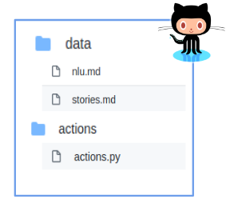
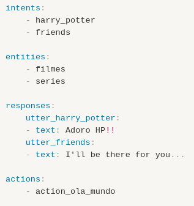
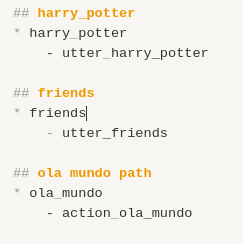
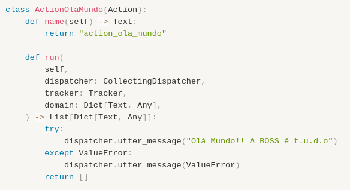
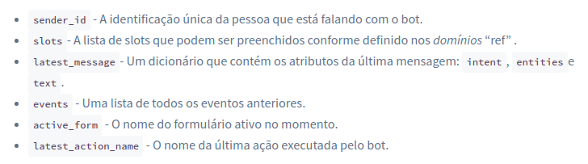
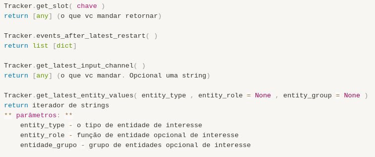
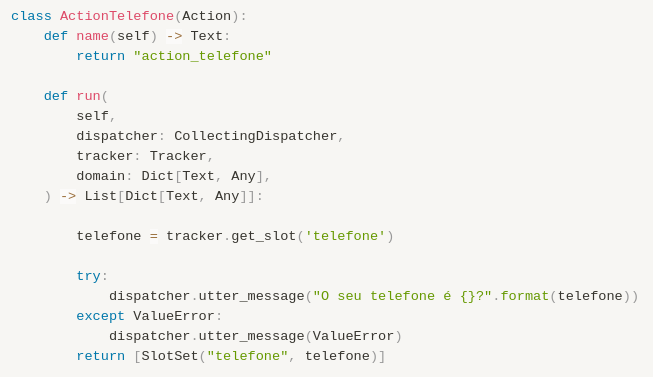

# Actions no RASA

>### Pontos-chave
>- O que é uma action?
>- Para que pode ser usada?
>- Como criar?
>- Quais são os métodos?
>- O que *run* recebe quando é acionada?
>- O que *run* retorna?
>- Quais tipos de actions podemos usar?

<div align="justify">

Quando iniciamos uma interação com o bot, após cada mensagem do usuário o bot vai pensar no que fazer em seguida. A decisão dele, essa ação que será tomada, pode ser a execução direta de uma utter (response) ou ser a chamada uma action. Pode-se criar actions que respondam em forma de texto, pode mandar uma imagem, pode acessar um banco de dados... muitas possibilidades, só precisa escolher o tipo de action ideal.

## Tipos de Actions
1. **Utterance actions (respostas comuns):** esse é o tipo mais simples de action. O bot vai responder com um texto comum. Significa, em linhas gerais, trocar o local em que a mensagem é declarada. Deixará de ser escrita em uma utter comum e passará a ser indicada dentro de uma action.

2. **Custom actions (personalizadas):** são as actions que você vai codar e elas, basicamente, podem fazer qualquer coisa. Por exemplo, você pode:

    - chamar uma API (Interface de Programação de Aplicativos - ou seja, é uma interface que já faz uma coisa específica. É um bloco pronto de código, você só precisa utilizá-lo);
    > No campo de leitura recomendada há um exemplo de API que retorna um endereço a partir de um CEP.

    - consultar um banco de dados;
    - inserir um evento no calendário da Google;
    - (quase) tudo de legal que você puder pensar 

3. **Forms (formulários):**  é um tipo especial de custom actions, que lida com lógica de negócios. Ou seja, se você precisa que o bot pergunte informações específicas ao usuário, tem que usar uma action de forms.

4. **Default actions (padrão):** são as actions que já existem padronizadas na grande classe Action, é só usar. Qualquer action padrão pode ser substituída, é só você escrever o nome dela no arquivo domain e sobrescrever o comportamento delas. As ações padrões são:
>Ps.: pode ser que haja mais. Confira no site oficial do RASA.

Desfaça a última mensagem do usuário como se ele não a tivesse enviado e o bot não tivesse reagido
```sh
action_back
```
Peça ao usuário para reformular sua intenção.
```sh
action_default_ask_rephrase  
```
Peça ao usuário para reformular sua intenção.
```sh
action_default_ask_rephrase
```
Peça ao usuário reafirmar sua intent... tipo refazer a pergunta. É bom sobrescrever essa.
```sh
action_default_ask_affirmation
```
Reinicie toda a conversa
```sh
action_restart
```

## Criar uma action
As actions devem estar **listadas** no arquivo domain e, caso sejam do tipo _utterance actions_, nas stories também. Mas elas estarão **descritas** em uma pasta separada, geralmente chamada de actions mesmo. Notem que as actions sempre serão aquivos Python!

Pastas no github ficam organizadas mais ou menos assim
<a align="center">

 

</a>

Actions listadas no domain

<a align="center">

 

</a>

Em caso de utterance action, listadas nos stories

<a align="center">

 

</a>

 Quando vc cria um projeto do rasa ele já vem com um arquivo genérico de actions.py, aí basta modificar.

 <a align="center">

 

</a>

## Métodos
A classe action é uma classe base para qualquer ação personalizada. Nela, existem dois métodos que devem ser substituídos:

```sh
def name (self)
def run (self, dispatcher, tracker, domain)
```
O método _name( )_ recebe apenas um parâmetro, o self.

Podemos dizer que todo objeto já nasce com uma espécie de "carimbo" que é o **self** (ninguém precisou declarar isso, quando um objeto em python é instanciado, automaticamente ganha esse "carimbo"). A classe possui métodos e para que os objetos dessa classe possam utilizar esses métodos, é necessário que você passe o self como parâmetro na hora de **declarar** o método. Mais uma vez batemos nessa tecla: declarar um método (criar ele) é diferente de utilizar esse método!

O método _run( )_ recebe 4 parâmetros de entrada e retorna uma lista de eventos. Os parâmetros são:
- **self**:  tem em todas as classes do python, é um identificador de que os objetos da classe poderão usar aquele método;  
- **dispatcher (despachante):** o dispatcher que é usado para enviar mensagens de volta ao usuário.
- **domain (domínio):** o arquivo domain.yml do bot, onde temos as intents, utters e actions listadas.
- **Tracker (rastreador):** esse cara vai acessar a memória do bot aqui na sua custom action. Você pode ter informações sobre eventos passados ou o estado atual da conversa.

O tracker possui atributos

 <a align="center">

 

</a>

E também possui métodos

 <a align="center">

 

</a>

## Slots
Os **slots** são a **memória** do seu bot. Eles agem como um armazenamento de valor-chave que pode ser usado para armazenar informações fornecidas pelo usuário (por exemplo, sua cidade natal), bem como informações coletadas sobre o mundo exterior (por exemplo, o resultado de uma consulta ao banco de dados).

Slots podem ser definidos através de:

- Dando um valor inicial direto no arquivo de domínio
- Definir direto no arquivo NLU, das stories, da mesma maneira que se define uma utter
- Clicando em botões (como escolher uma cor)
- Definido por ações

Para definir por ações, você precisa incluir o slot nas **stories** e depois utilizar na actions.py. Uma action que utiliza slot pode se parecer com a imagem abaixo

 <a align="center">

 

</a>

As actions nos permitem criar uma infidade de funções para o bot. Explorem os diferentes tipos de actions, seus argumentos e as particularidades de cada um para contribuir de maneira bem legal! Divirta-se!! :)

## Leitura recomendada
Os sites listados aqui serviram como base para o conteúdo descrito, e sugerimos fortemente que leiam tópicos extras da documentação do RASA que pe bem completa.

>Ps.: O RASA possui uma versão atualizda e uma versão legado para o site, ambas na ativa. Caso uma não funcione, calma: existe a outra.

- [Actions](https://rasa.com/docs/rasa/actions#responses)
- [Métodos da action](https://legacy-docs-v1.rasa.com/api/rasa-sdk/#rasa-sdk)
- [Tracker](https://legacy-docs-v1.rasa.com/api/rasa-sdk/#rasa_sdk.interfaces.Tracker.get_slot)
- [Slots - Definição](https://legacy-docs-v1.rasa.com/core/slots/#what-are-slots)
- [Slots - Usos](https://legacy-docs.rasa.com/docs/core/slots/)
- [API que pega endereço a partir do CEP - Postmon](https://postmon.com.br/)

</div>