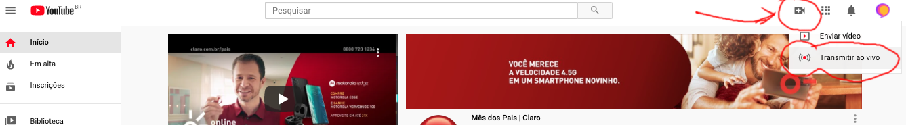
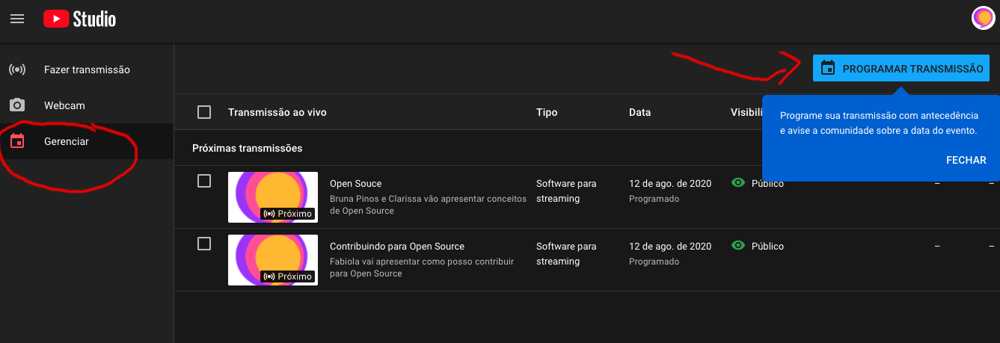
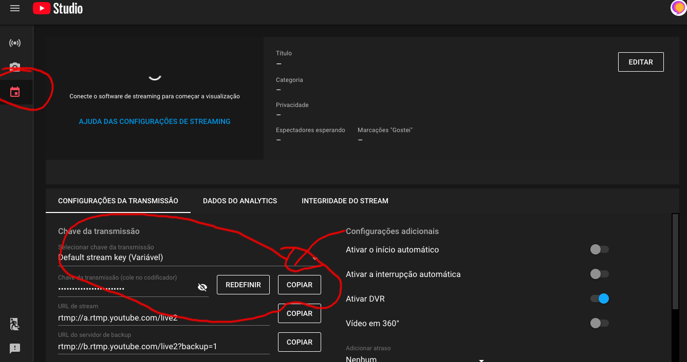
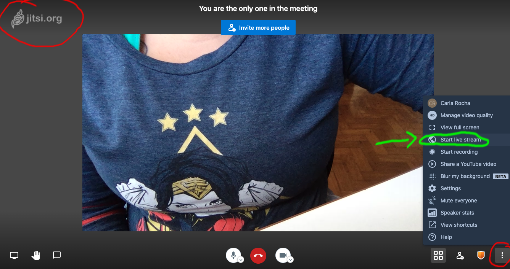
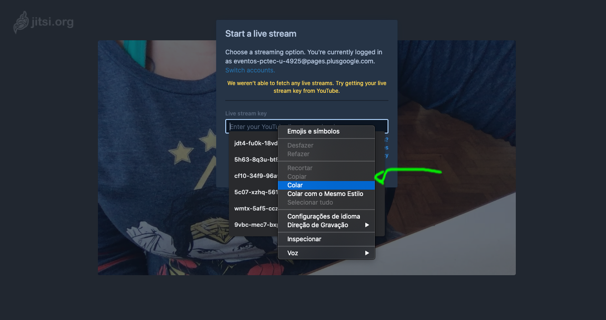
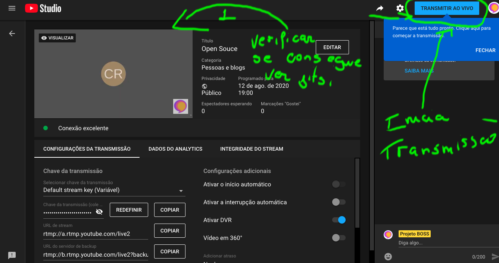

# Configurando sua Live Jitsi + youtube

## 1.  Configuração Live Youtube
A primeira parte consiste em planejar a live. Tem duas possibilidades: ou iniciar imediatamente a live ou programar uma live para um dia/horário específico. Ambas seguem os mesmos procedimentos

- [ ] Entre na página do youtube (www.youtube.com) logado com a conta do gmail do BOSS
- [ ] No canto Superior direita da página do youtube tem uma câmera, clique nela e escolha a opção Transmissão ao vivo

- [ ] Dessa forma, você entra no Youtube Studio. A esquerda, selecione a opção "Gerenciamento" (tanto para fazer uma live imediata quanto programar uma live)

- [ ] Clique para "Programar Transmissão". Edite as configurações: Nome do vídeo, se é público, listado ou privado, pode alterar a miniatura e se o conteúdo é ou não para crianças.

- [ ] Volte a página de "Gerenciamento" e clique em cima da live que você acabou de criar. Você entra na real configuração da live. Essa é a página que você vai gerir sua live (quantas pessoas estão vendo, gerir comentários, etc). Observe que na aba "Configurações da Transmissão" tem um campo chamado "Chave da Transmissão".  Copie essa chave e vá para o Jitsi! Observação: essa chave é única por conta do youtube, ou seja, será a mesma para todas as lives:)

## 2. Integrando o Jitsi no Youtube

- [ ] Entrar no link da vídeo chamada no https://meet.jit.si/boss
- [ ] A direita inferior, clique nos três pontinhos e na opção de Iniciar transmissão ao vivo

- [ ] Na página do Jitsi ele está aguardando a Chave para transmissão ao vivo.  Cole a chave que você copiou no youtube. Se tudo estiver certo, vai ouvir em inglês no Jitsi "Live streaming is on"

Sua configuração de live está pronta!! O início da live ocorre de forma manual sempre (mesmo que tenha agendado a live, o início dela é manual). Volte para o youtube para iniciar a transmissão da live :P

## 3. Iniciando/Finalizando a Live

- [ ] Entre na página de gerenciamento da Live no youtube (Está explicado na primeira parte, é entrar no "Gerenciamento" da live específica). 
- [ ] Se a cofiguração estiver correta, você verá a o jitsi na página de gerenciamento. No canto direito, tem botão "Iniciar transmissão". Ai é clicar nesse botão tanto pra iniciar quanto finalizar a transmissão.

- [ ] Agora é aproveitar sua live!
