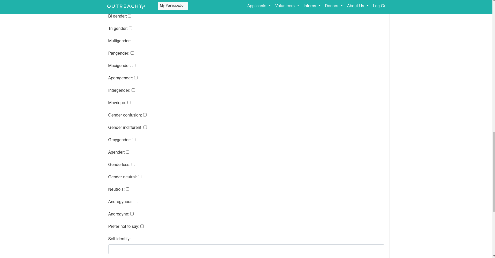

# Post Mortem BOSS 2020_02

Esse documento foi criado com o objetivo de identificar, durante e após a realização da primeira edição da BOSS, pontos de melhoria para edições futuras. Esses pontos serão discutos em reuniões ao final desse primeiro ciclo, em que possíveis soluções serão levantadas e analisadas.

## Melhoria 01 - Plataforma centralizada da BOSS

O período de inscrição dessa primeira rodada da BOSS foi um tanto quanto conturbado, principalmente pela falta de centralização de informações. Muitas mentoradas e possíveis participantes ficaram confusas sobre o que o projeto visa, como se inscrever e a diferença entre as frentes da BOSS. Acabou que as informações foram espalhadas pelas redes sociais, cada uma de uma forma, o que pode causar confusão e incosistência. Acho esse um ponto importante para o crescimento do projeto.

Sugestão: Durante o período entre o fim desse ciclo e o próximo, criarmos um site em que centralizaremos tudo, informações, formulários de inscrição, links das nossas plataformas, etc.

## Melhoria 02 - Formulário de Inscrição

Nosso formulário essa rodada deixou um tanto a desejar, o que acabou levantando algumas problemáticas. Divulgamos que teriamos vagas específicas para pessoas trans, pessoas pretas, mas não nos atentamos a isso no formulário e acabamos tendo que checar no telegram. Acabou que essa rodada ficou sem uma mentorada trans. Importante ressaltar que algumas dessas melhorias se beneficiariam muito de uma plataforma própria da BOSS. Tendo isso em vista, alguns pontos de melhoria que podem ser aplicados:

- **Nome da Pessoa Participante** 

Realmente precisamos do nome legal da pessoa? O nome é uma questão muito delicada para pessoas trans, principalmente para aquelas que ainda não conseguiram retificar os documentos legais. Tendo em vista que não precisamos dessa informação para nada, seria bom trocar o campo **Nome** para **Como gostaria de ser chamada?**. Isso abriria a possibilidade para essas pessoas colocarem o que quiserem, e também mostra que estamos preocupadas com o conforto das participantes.

- **Identidade de Gênero**

Essa também é uma questão delicada. Nesse caso, sinto que poderiamos nos inspirar no [Outreachy](https://www.outreachy.org/). No formulário de inscrição, existe uma lista extensa de opções para a participante. Também existe um campo **Self Identify** em que a participante pode utilizar um gênero que não está listado.

- **Campo de pronomes**

Adicionar um campo referente ao pronome pelo qual a pessoa prefere ser chamada.

## Melhoria 03 - Data da BOSS

Ao início do projeto, definimos que a BOSS ocorreria seguindo o mesmo calendário da UnB, o que acaba sendo bem próximo do calendário de outras faculdades também. Porém, como grande parte do nosso público alvo como mentoradas acaba sendo pessoas que estão na faculdade, seria essa realmente a melhor data? Durante essas semanas de projeto é perceptível o quanto algumas mentoradas estão tendo dificuldades ao conseguir se manter em dia com as atividades e conteúdos, por estarem ocupadas com faculdade e estágios.

Sugestão: Poderiamos mudar a data da BOSS para acontecer entre Dezembro-Março e Final de Junho - Agosto(Essa data ainda teria overlap com calendário estudantil, mas também pegaria as férias de julho e apenas o inicío do semestre.). Além disso, conversando com a Anna, ela deu a ideia de prepararmos as mentoradas também para tentar engajar em programas como o Gsoc e Outreachy. Isso também solucionaria um de nossas preocupações, que era para onde essas mentoradas poderiam ir e aprimorar seus conhecimentos após a BOSS.

## Melhoria 04 - Milestones para as fases do projeto
Seria interessante que o repositório de cada edição seja organizado previamente para "iniciar os trabalhos". Uma ideia é termos uma área específica para que as participantes possam contibuir e ver os resultados efetivos de suas contibuições. As tarefas da semana que são passadas poderiam vir em formato de issues em milestones específicas.  Por exemplo, a parte de contribuição com o bot seria uma milestone e a inserção de utters e intents por parte das participantes seriam issues a serem resovidas.
Assim, teríamos vários ganhos, como:
- um repositório incialmente "vazio" que vai evoluindo à medida em que as pessoas colaboram (evolução visual ainda);
- percepção sobre quem tem mais facilidade e quem apresenta maior dificuldade em aspectos determinados;
- exploraremos a ideia do pareamento, pois cada issue pode ser designada uma a dupla definida no dia da apresentação do conteúdo (não é necessária especificação sobre como resolver ou a temática da contribuição, apenas atribuir uma issue para possibilitar que a pessoa efetivamente se sinta finalizando uma tarefa);
- Aprimorar o uso do github e suas funcionalidades, como desenvolvimento em um mesmo branch, contribuição usando co-authored, atribuição de revisadores, linkar PR's com issues específicas, marcar uma milestone, fechar issues, etc.
- Aumento do senso de pertencimento na comunidade;
- Ao final do projeto, teremos rastreabilidade de contribuição e um repositório organizamente incrementado.

## Melhoria 05 - Preparar cronograma semanal
Enviar um email de forma regular e semanal para as participantes informando sobre o cronograma da semana para que o grupo do telegram sirva apenas para interação entre as pessoas e reforço sas informações do email. Desta forma, nada importante será perdido e teremos a certeza de que tadas as pessoas terão visto os avisos.

## Melhoria 06 - Criar um momento para incentivar as dúvidas
As participantes apresentaram dificuldades em deixar suas dúvidas públicas no grupo, a maioria das vezes não enviam dúvidas por inciativa pessoal e algumas vezes não respondem no grupo. Então seria interessante dedicar um dia ou momento aberto para que todas as pessoas compartilhem suas dúvidas e/ou erros que surgiram, corrigidos ou não. Isso pode incentivar a prática de externalizar dúvidas em grupo.

## Melhoria 07 - Otimizar os formulários de acompanhamento
Para esta edição o formulário de acompanhamento foi utilizado da seguinte forma: um formulário por semana para todas as mentoradas, o mesmo para o formulário das mentoras. Porém, isso dificulta o real acompanhamento do progresso de cada pessoa uma vez que é necessário ficar abrindo formulário por formulário para conseguir um comparativo. Então, como melhoria, podemos criar um formulário individual para cada pessoa, de forma que ele seja alimentado toda semana. Assim, será possível abrir o forms de uma determinada pessoa e ter todas as informações dela de forma compilada, além dos gráficos gerados pelo forms que auxiliarão demais na hora de avaliar o desenvolvimento da pessoa ao longo do tempo.

